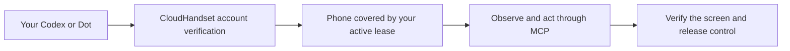

# CloudHandset MCP Plugins

**Give your AI agent a real Android phone.**

Connect your own Codex or OpenAI Dot to the physical Android phones covered by your CloudHandset leases. Your agent can inspect the screen, perform the task you request, verify the visible result, and release control when finished.

[CloudHandset website](https://www.cloudhandset.com) · [Codex installation](CODEX_INSTALL.md) · [Dot installation](DOT_INSTALL.md) · [Releases](https://github.com/ziyouzhilong/cloudhandset-mcp/releases) · [Changelog](CHANGELOG.md) · [Support](SUPPORT.md)

**Required model for phone operation:** Select **GPT-6.1 Sol or a more capable model** in your agent before asking it to operate the phone. This requirement applies to phone operation, not plugin installation.

## Download

| Client | Current package | Get started |
| --- | --- | --- |
| Codex | [CloudHandset for Codex 0.1.2](https://github.com/ziyouzhilong/cloudhandset-mcp/releases/download/plugins-2026.10.09/cloudhandset-codex-plugin-0.1.2.zip) | [Installation guide](CODEX_INSTALL.md) |
| OpenAI Dot | [CloudHandset for Dot 0.2.1](https://github.com/ziyouzhilong/cloudhandset-mcp/releases/download/plugins-2026.10.09/cloudhandset-dot-setup-0.2.1.zip) | [Installation guide](DOT_INSTALL.md) · [First screen check](DOT_SETUP.md) |

Download the ZIP for your client. Upload it to a Codex conversation in Work mode for setup assistance, or extract it and follow the manual guide. Use [SHA256SUMS](https://github.com/ziyouzhilong/cloudhandset-mcp/releases/download/plugins-2026.10.09/SHA256SUMS) to verify the original downloads. GitHub's automatically generated **Source code** archives contain the project documentation; choose the named plugin ZIP for installation.

These public packages contain no login credentials or pre-bound customer connection. Every customer signs in with their own CloudHandset account. The Dot ZIP is a setup kit: create your account connection, bind its technical ID, and generate the smaller archive to upload to ChatGPT Plugins.

## Connection flow



## What your agent can do

| Capability | How it is used |
| --- | --- |
| Find your phones | List the Android phones available through the authenticated connection. |
| Inspect the screen | Receive a current screenshot and use its actual image coordinates. |
| Operate Android apps | Tap, swipe, scroll, enter text, and send supported key or gesture inputs. |
| Verify progress | Obtain a fresh screenshot after an action and check its visible result. |
| Resolve an uncertain action | Check the original operation and observe its result before continuing. |
| Finish cleanly | Release held inputs and confirm that phone control has closed and drained. |

Phone control follows the task you give the agent and the approvals required by its host. The agent should not interrupt another operator. CloudHandset MCP does not provide audio or an arbitrary shell tool.

## Before you install

- A CloudHandset account with an active lease for a provisioned Android phone.
- A supported client that can use MCP tools and inspect the images returned by them.
- **Codex:** a version with plugin support. Package installation was checked with Codex CLI `0.162.0-alpha.2`; the guide also includes a manual MCP connection route.
- **Dot:** an account with **Create custom MCP server** and **Upload plugin archive**, plus Python 3.9 or later to bind and package your copy. On Windows, use `py -3` in place of `python3`.

Nothing from these packages needs to be installed on the Android phone. The connection becomes useful after you complete your own account verification and first screen check.

## Install for Codex

In a Codex conversation in **Work mode**, upload the plugin ZIP and ask Codex to install it for you. Complete your own CloudHandset login in the separate verification window when prompted.

### Manual installation

Extract `cloudhandset-codex-plugin-0.1.2.zip`, open a terminal in the extracted `cloudhandset-codex/` folder, and run:

```sh
codex plugin marketplace add .
codex plugin add cloudhandset@cloudhandset
codex plugin list
codex mcp get cloudhandset
codex mcp login cloudhandset
```

If installation already completed verification, another login is unnecessary. Keep an existing working CloudHandset connection and check conflicts before changing it; do not create duplicate MCP servers. Keep the extracted plugin folder available, then open a new Codex conversation.

Start with:

> Use $cloudhandset-phone to list my Android phones, let me choose one if needed, inspect its current screen, and release control. This is a screen check only; do not tap or type.

See the [Codex installation guide](CODEX_INSTALL.md) for the manual alternative, login expiry, troubleshooting, and removal.

## Install for Dot

Alternatively, upload the entire setup ZIP to a Codex conversation in **Work mode** and ask Codex to help you install it. You still need to complete your own account verification; the full setup ZIP is a chat attachment for setup assistance, not the archive to import through ChatGPT Plugins.

### Manual installation

1. Open [ChatGPT Plugins](https://chatgpt.com/plugins) and choose **Add → Create custom MCP server**.
2. Enter the settings below, then complete **Verify and connect** in the separate CloudHandset verification window.
3. Extract the Dot setup ZIP. In `cloudhandset-dot/`, run `python3 bind-connection.py YOUR_CONNECTION_TECHNICAL_ID` using the real `asdk_app_…` or `plugin_asdk_app_…` ID from your newly created connection.
4. In the extracted `plugin/` folder, run `python3 -m zipfile -c ../cloudhandset-dot-connected.zip plugin.json .app.json skills`.
5. In ChatGPT Plugins, choose **Add → Upload plugin archive**, upload the generated `cloudhandset-dot-connected.zip`, and install/enable it for the account used by Dot.

| Connection setting | Value |
| --- | --- |
| Server URL | `https://device.cloudhandset.com/mcp` |
| Authentication | OAuth |
| Registration method | Custom OAuth client / pre-registered client |
| OAuth client ID | `cloudhandset-dot` |
| OAuth client secret | Leave empty |
| Token endpoint authentication method | `none` |
| Scope | `device:control` |
| Expected callback URL | `https://chatgpt.com/connector_platform_oauth_redirect` |

Use these settings only when the displayed callback matches exactly. The client ID is a public application identifier. If your account lacks the required options or displays another callback, contact CloudHandset support through the [website](https://www.cloudhandset.com).

The installed plugin should show **one connected CloudHandset app** and **one android-phone skill**. Do not upload the full setup ZIP. Keep your generated, account-bound archive private; distribute only the original unbound download.

Start with the [Dot screen-check prompt](DOT_SETUP.md). The [complete Dot installation guide](DOT_INSTALL.md) also explains the optional local Codex route, which requires an online computer connected to Dot.

## How account access works

The MCP endpoint is `https://device.cloudhandset.com/mcp`. Your client opens an independent English verification window for your CloudHandset login. Enter your credentials there, not in an agent conversation. If multiple phones are eligible, select the phone you want to use.

Authorization lasts **up to 30 days** and ends earlier when the selected phone's effective lease expires. When it expires, complete a new verification flow before continuing. Reauthentication cannot extend a phone lease. There is no separate Agent/MCP authorization page in the CloudHandset website console.

Each phone has one active controller. When a person takes control back through CloudHandset, the agent must stop. Resuming agent control requires an explicit request and fresh verification. At the end of a task, the agent should confirm that its control session is closed and drained.

## FAQ

### Is this a public plugin marketplace listing?

This repository provides downloadable installation packages. Codex uses the included local plugin marketplace. Dot customers create their own MCP connection and upload their own bound skill archive. There is no one-click public marketplace installation in this release.

### Does installing the package connect a phone automatically?

You must authenticate your own CloudHandset account and have an eligible phone lease. Installing a skill alone does not grant phone access. Run the first screen check after setup to confirm that the agent can inspect an actual image and release control.

### Can new phones use the same setup?

Existing and newly provisioned phones use the same client setup. A phone must finish provisioning and have an effective lease before it is eligible. Select and verify access to the phone you want the agent to use.

### Does my computer need to stay online?

Codex needs its executing computer to remain available. Dot's direct cloud connection does not require your personal computer to stay online. The optional Dot-to-local-Codex route does. None of these packages installs an always-on task runner or guarantees indefinite or scheduled background execution.

### Why does Codex return to a localhost address after login?

Codex can receive its OAuth callback at `127.0.0.1` on your computer. The phone-control service still uses the public HTTPS MCP endpoint. Never share a complete callback URL, token, password, or verification code in chat.

### What if an action times out or the phone is busy?

Do not take over a busy phone. For a timed-out action, preserve its original operation ID, check its status, and inspect the associated screen. Do not repeat an action whose outcome is unknown. The included skills guide the agent through these cases and report unresolved cleanup.

### Does uninstalling a plugin revoke access?

Removing a skill, disconnecting an app, and revoking a CloudHandset authorization are separate actions. Release phone control before disconnecting. Codex logout removes local credentials; it does not revoke the server-side grant. For immediate server-side revocation, contact CloudHandset support through the [website](https://www.cloudhandset.com).

### Where can I get help?

Start with the installation guide for your client. For account, lease, connection, or revocation assistance, use [CloudHandset](https://www.cloudhandset.com). Include the client version and a redacted error message; keep credentials and private phone screenshots out of public reports.

## Package contents

| File or folder | Purpose |
| --- | --- |
| Codex setup ZIP | Local plugin marketplace, MCP configuration, phone-operation skill, and installation guide. |
| Dot setup ZIP | Connection-binding script, unbound Dot skill, installation and first-use guides, and the optional Codex dependency. |
| [CODEX_INSTALL.md](CODEX_INSTALL.md) | Complete Codex setup and account-access guidance. |
| [DOT_INSTALL.md](DOT_INSTALL.md) | Complete Dot OAuth, per-account binding, and archive-upload instructions. |
| [DOT_SETUP.md](DOT_SETUP.md) | First-use prompts and control/recovery behavior. |
| [SHA256SUMS](SHA256SUMS) | Checksums for the downloadable packages. |

This repository distributes client setup packages and documentation for the CloudHandset service.
